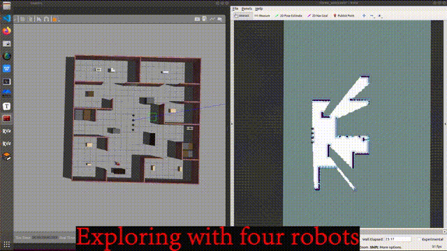

# CURE1

CURE1 is a multi-robot exploration planner that first proposed using unknown regions to guide exploration. This is a minimalist version of CURE1 that you can quickly deploy and run.


<p align="center">
 
 
</p>
<div style="display: flex; justify-content: center; gap: 10px;">
	<figure>
  		
    </figure>
    <figure>
  		
    </figure>
</div>
**Video Link:** [Bilibili Video 1](https://www.bilibili.com/video/BV1j64zePEbZ/?spm_id_from=333.1387.homepage.video_card.click&vd_source=0e7c59dd804a18d9a9c201eafe9ac6e5); [Bilibili Video 2](https://www.bilibili.com/video/BV1oB4zeeEDm/?spm_id_from=333.1387.homepage.video_card.click&vd_source=0e7c59dd804a18d9a9c201eafe9ac6e5); [Youtube](https://youtu.be/P5jXKlGQOec)

**Paper:** [IEEE](https://ieeexplore.ieee.org/document/10155622)

> Q. Bi et al., "CURE: A Hierarchical Framework for Multi-Robot Autonomous Exploration Inspired by Centroids of Unknown Regions," in IEEE Transactions on Automation Science and Engineering, vol. 21, no. 3, pp. 3773-3786, July 2024, doi: 10.1109/TASE.2023.3285300.

If it is useful to you, please cite our paper and ⭐️ our code. Thanks!

**News:**

- Apr 9, 2025: The code for CURE is released.
- Jun 6, 2023: The paper is accepted by T-ASE.
- Nov 11, 2022: The paper is submitted to T-ASE.

## Quick Start

These instructions assume that ROS Noetic desktop-full is installed. 

Ensure that Opencv 4 has been installed. When installing ROS Noetic desktop-full, it is usually installed by default. 

The OpenCV version we are using is 4.2.0. View OpenCV version:

```bash
opencv_version
```

### 1. Prerequisites

```bash
sudo apt-get install ros-noetic-gmapping ros-noetic-navigation ros-noetic-teb-local-planner
```

```bash
sudo apt-get install ros-noetic-gazebo-ros-control ros-noetic-diff-drive-controller ros-noetic-joint-state-controller ros-noetic-robot-state-publisher
```

### 2. Build CURE

Then simply clone and compile our package:

```bash
cd ${YOUR_WORKSPACE_PATH}/src
git clone git@github.com:NKU-MobFly-Robotics/CURE.git
cd ../ 
catkin_make
```

### 3. Run CURE in simulation

After the compilation is successful, you need to open two terminals and run the following two commands.

```bash
source devel/setup.bash && roslaunch cure_planner three_p3dx.launch
```

```bash
source devel/setup.bash && roslaunch cure_planner exploration.launch
```

## Run CURE in other scenes

Modify lines 7-8 of three_p3dx.launch.

## Acknowledgements

We sincerely appreciate the following open source projects: [rrt_exploration](https://github.com/hasauino/rrt_exploration), [p3dx](https://github.com/NKU-MobFly-Robotics/p3dx).
